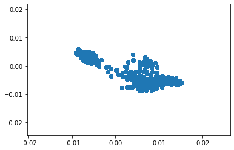
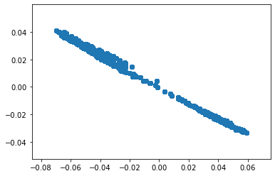
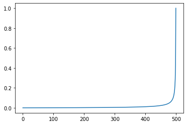

# Power BI App for Visualizing Dataset behaviour

In this project, a power bi based visualization app is proposed to analyze the neighborhood of the dataset using Quality Spatial Relations (QSR). Two datasets have been used to be analysed under Monte Carlo Tree Search (MCTS) and also other popular Machine Learning algorithms. MCTS uses a UCB (Upper Confidence Bound) based reward system that simulates within the state space of every dataset. 

## Datasets used

From Speech project, [The RAVDESS dataset](https://www.kaggle.com/uwrfkaggler/ravdess-emotional-speech-audio) based on the paper [The Ryerson Audio-Visual Database of Emotional Speech and Song (RAVDESS)](https://journals.plos.org/plosone/article?id=10.1371/journal.pone.0196391) has been analysed using [speech_sigproc.py](./speech/audio/speech_sigproc.py). 

From OCR project, [The FUNSD Dataset](https://guillaumejaume.github.io/FUNSD/) based on the paper [FUNSD Paper](https://arxiv.org/abs/1905.13538) has been pre-processed using [preprocess.py](./ocr-data/text/preprocess.py).

## State Space Model

A state space model consisting of features and labels are fed into an MCTS algorithm. The state space model for each dataset consists of observations and transitions. When the data transitions to another state from an initial random state, the UCB model which is a multi-armed action bandit model, executes a Monte Carlo learning for `n` simulations. After obtaining the final state from an input state, the final state looks at the defined clusters which are ordered by a chosen metric. The number of maximum clusters are defined in the app user interface. The maximum clusters should not exceed the state space dimension of the input data.

### Observations

Observations are inferences from the feature extraction stage. Let's say we converted Audio signals into `120` mels, and then execute a `FastICA` on the mels, we get a dimensionality reduced mixing matrix plotted as a point cloud plot as shown:





### Transitions

Transitions are estimated factors assumed to be hierarchical which are derived from the observations. The factors obtained are Gaussian in nature and they are vectorized into `speech/state_space/models/factor_analysis.onnx` model.

## MCTS Algorithm

The Monte Carlo Tree Search Algorithm updates the rewards based on the end result obtained instead of its online counterpart Temporal Difference Learning, TD (lambda). The algorithm clusters using ward linkage, with a maximum clusters parameter. 

Here are the results shown during training of the Reward Scores, No. of Units, Chosen probability density function:

**Below is the beta plot used for speech:**


**Below is the weibull distribution used for OCR:**



**Below is the no. of units used for calibration of weibull:**


## Data Processing

For a dataset, the feature extraction is the first step. An Expectation Maximisation step has likelihoods in various forms. For factor analysis, there is a marginal likelihood; for dirichlet processes, the likelihood is a differential equation. Since the EM step is Gaussian in nature, the probability distribution(s) is/are used for clustering and searching the dataset. 

The episode scores obtained from running the MCTS algorithm, must be sorted in order to create a time series data for QSR analysis. The timestamps will be corresponding to `argsort()` of `episode_scores`. The rewards are hierarchical in nature, and hence the sorting of the scores are performed. 

### Feat file extraction

For evaluating the features from audio, the log mel spectrum and mel filterbank are produced. A hamming window is used to process the audio.

#### Mel Spectrum

Audio Signal
____________


Mel Filterbank
____________


Mel Spectrum
____________


```python

def process_feat(samp_rate=48000):

    # code here
    
    x, s = librosa.core.load(wav_file)

    fe = sp.FrontEnd(samp_rate=s,mean_norm_feat=True,
        frame_duration=0.032, frame_shift=0.02274,hi_freq=8000)

    feat = fe.process_utterance(x)

```

### ICA

For evaluating ICA mixing matrix, a random_state=42 is used. 

```python

def process_ica(feat_actors, random_state=42):
    # code here
    ica = FastICA(n_components=n_actors, random_state=42)
    # code here

```

### Factor Analysis

For evaluating Factor Matrix with Noises, the means of the ica mixing matrix are stacked as shown here.

The factor analysis uses a library which can be installed using:

> pip install --user factor_analysis==0.0.2

```python

def process_factors(ica_mixing_array, strings):
    # code here
    # here, state_dim is the speech audio string

    f = factor_analysis.factors.Factor(ica_mixing_array[state_dim], 
    factor_analysis.posterior.Posterior(np.cov(ica_mixing.T), 
    
    # mean values are stacked by number of actors here for factor analysis input

    np.concatenate([

        np.mean(ica_mixing,axis=0).reshape(1,-1)/ica_mixing.shape[1]

    ] * ica_mixing.shape[1], axis=0)))

```

## Training of dataset parameters

For the OCR project, the state space dimensions are:

Observations: 199
Transitions: 5823

For the Speech project, the state space dimensions are:

Observations: 60
Transitions: 24

It takes a huge time to train the state space for OCR project. The results are shown here:

Episode scores for Speech:
--------------------------

**As you can see the rewards obtained here (colored green) are either power series or harmonic functions but not asymptotic in nature.**


Episode scores for OCR:
-----------------------

**As you can see the rewards obtained here are asymptotic in nature.**


## App Main Page

The App main page is a QSR visualizer page. When the maximum clusters are provided, the app asks for reward bias as well for input to MCTS simulation. 

#### Computational Models used for the Power BI App

How to execute the app
-------------------------------

./speech/state_space/qsr.sh --d all

This command shows the final QSR plot after going through a `2` epoch training loop with Speech dataset, and another training loop with `all` distributions.

QSR Visualizer provides 2 plots:

- A Calculus plot (involving Region Connection Calculus (RCC), Ternary Point Configuration Calculus (TPCC))
- A Graphlet (involving temporal information integrated with the calculus)

All `.npy` files within [tmp_models](./speech/state_space/tmp_models) form the World Trace objects.

How to train the vectorized model `factor_analysis.onnx`
---------------------------------------------------------

python ./speech/state_space/factor_analysis.py --n_iter=20000 --learning_rate=0.001 --filepath=./speech/state_space/models/factor_analysis.onnx

##### Inference from the onnx model

```python

import onnxruntime as nxrun
sess = nxrun.InferenceSession("./speech/state_space/models/factor_analysis.onnx")

results = sess.run(None, {'latent': np.load('speech/dataset/latent.npy')})

```

### MCTS Results

The MCTS algorithm replicates the source dataset of speech for searching the dataset:

- by factor analysis correlation
- by maximising the reward by least noise

In the case of MAX_CLUSTERS = 11, MCTS coverage is obtained to be 1.0
In the case of MAX_CLUSTERS = 20, MCTS coverage is obtained to be 0.75

```python

MAX_CLUSTERS = 11
NOISE_PARAM = 4.30

mcts_reward = (MAX_CLUSTERS - self.cluster) / MAX_CLUSTERS + NOISE_PARAM - \
        scaler.transform(((np.array([self.noise]*action_count) - noise_mean) / noise_std).reshape(1,-1)).flatten()[0]

```

The MCTS algorithm replicates the source dataset of ocr for searching the dataset:

- by latent sematic analysis similarities
- by maximising the reward by a regularized similarity

```python

MAX_CLUSTERS = 1000
NOISE_PARAM = 4.30

mcts_reward = (MAX_CLUSTERS - self.cluster) / MAX_CLUSTERS + NOISE_PARAM - \
        scaler.transform(((np.array([self.similarity]*action_count) - similarity_mean) / similarity_std).reshape(1,-1)).flatten()[0]

```

## Data Wrangling

In the data wrangling stage, the data is processed through a complex plane where there is timestamp information recorded from the output of UCB scores from a Monte Carlo Simulation. Also, the time series is unit spaced with each recorded variable being: 

- no. of units required for calibration, 
- the chosen probability density function,
- scores that are scaled from 0 to 1

## Multi-armed bandit frameworks

In a multi-armed bandit framework, a person simulates the environment by taking actions from a multi-labeled data source. The reward tree structure considers two approaches that have been documented based on:

- Least Noise model, in the case of Factor Analysis
- Maximum Similarity model, in the case of Latent Semantic Analysis


## Results of Execution (Speech Data)

### Analysis of Use Cases

#### Beta Distribution

The net time taken to produce the Qualitative Spatio-Temporal Activity Graph (QSTAG)

Time:  0.0235321521759

Histogram of Graphlets:
[2, 2, 3, 2, 2, 1]

#### Cauchy Distribution

The net time taken to produce the Qualitative Spatio-Temporal Activity Graph (QSTAG)

Time:  55.6756868362

Histogram of Graphlets:
[63, 23, 54, 42, 100, 32, 13, 49, 1, 42, 21, 16, 28, 4, 2, 29, 18, 9, 2, 7, 18, 9, 8, 9, 7, 4, 10, 6, 6, 9, 3, 1, 17, 7, 1, 1, 3, 1, 1, 1, 1, 1, 1, 1]

#### Gamma Distribution

Time:  365.94026804

Histogram of Graphlets:
[2, 100, 69, 58, 15, 127, 50, 45, 39, 35, 2, 65, 29, 27, 112, 30, 28, 24, 7, 1, 4, 39, 14, 22, 27, 23, 2, 2, 1, 12, 2, 1, 2, 5, 5, 1, 3, 3, 3, 3, 1, 1, 3, 2, 2, 2]

#### Rayleigh Distribution

Time:  11.341711998

Histogram of Graphlets:
[78, 76, 77, 77, 76, 75, 1, 1, 1, 1, 1, 1]

#### Weibull Distribution

Time:  190.360364914

Histogram of Graphlets:
[30, 9, 64, 125, 19, 81, 58, 59, 44, 60, 18, 18, 14, 29, 3, 23, 3, 24, 86, 33, 14, 40, 1, 3, 6, 3, 4, 4, 2, 1, 3, 1, 3, 2, 2, 2, 3, 2, 1, 2, 1]
